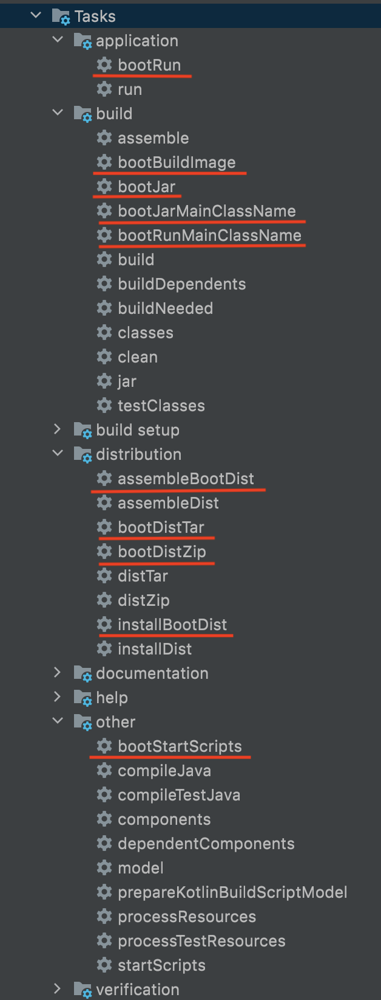

# Gradle, сложно о простом

##Gradle включение зависимостей в проект.

Чаще всего в проектах под управлением сборщика Gradle можно встретить такие примеры включения зависимостей.
Вопрос на внимательность, какой из перечисленных вариантов НЕ будет работать при сборке проекта на Gradle версии 6.x и выдаст ошибку?
```groovy
// 1
compile 'org.projectlombok:lombok:1.18.20'
// 2
compile "org.projectlombok:lombok:1.18.20"
// 3
compile ('org.projectlombok:lombok:1.18.20')
// 4
compile group: 'org.projectlombok', name: 'lombok', version: '1.18.20'
// 5
api 'org.projectlombok:lombok:1.18.20'
// 6
compileOnly group: 'org.projectlombok', name: 'lombok', version: '1.18.20'
// 7
implementation group: 'org.projectlombok', name: 'lombok', version: '1.18.20'
// 8
compile 'org.projectlombok:lombok'
```
.

.

.

.

.

.
`

Ответ: **Никакой**, при всех вариантах будет работать!

По факту список выше можно дополнить еще несколькими вариациями, но для экономии времени опустим их.
То что вы видите выше это один из плюсов и одновременно минусов данной переходной версии Gradle. 
Тут Gradle прощает нам много неточностей, и при попытке собрать проект все будет работать так как и ожидалось. 

Рассмотрим данные допущения более детально, и попробуем понять с чем они связаны.

1. Как известно Gradle в своей основе использует скриптовый синтаксис jvm-ориентированного языка groovy. 

1.1. В связи с этим для пунктов 1, 2, 3 groovy разрешает использование различных конструкций строки. 
Одинарные кавычки представляют неизменяемые строки, двойные их полная противоположность - изменяемые (это поверхностное описание, для более точных различий используйте документацию языка groovy). 

Одна из особенностей изменяемых строк в groovy это подстановка параметров типа "Hello ${name}", при этом "{}" тоже можно опустить (данная строка - экземпляр GString). 

Вот один пример:
```groovy
// пример 1.1
implementation "io.github.openfeign.form:feign-form:$feign_form_version"
// пример 1.2
implementation 'io.github.openfeign.form:feign-form:$feign_form_version'
```
Если в файле gradle.properties или в блоке ext build.gradle задана константа типа: 
```groovy
// gradle.properties
feign_form_version = "3.8.0"
// or build.gradle
ext {
    feign_form_version = "3.8.0"
}
```

в примере 1.1 на выходе мы получим -> "io.github.openfeign.form:feign-form:3.8.0"

в примере 1.2 на выходе -> "io.github.openfeign.form:feign-form:$feign_form_version"

1.2. Скобки в функциях принимающих один параметр можно опустить, также можно опустить скобки при использовании именованных параметров как в примере 4

2. Пример 5 демонстрирует нам объявление зависимости как **api**. Донная команда используется наравне с **implementation**, но с разрешением доступа к api транзитивных зависимостей (об этом более подробно поговорим дальше).

3. Пример 6 и пример 7 это пример "нового" синтаксиса объявления зависимостей пришедшего к нам с версией Gradle 3.4 (и об этом ниже)

## Когда и что нужно использовать при добавлении в проект зависимостей
В данном разделе я хотел бы немного рассказать о разнице в импорте зависимостей **compile** <--> **implementation** и прочих.

Для начала обратимся к официальным рекомендациям по upgrade gradle до версии 6.х с прочих версий 
[upgrading_version_6](https://docs.gradle.org/current/userguide/upgrading_version_6.html):
```
Removed Configuration	    New Configuration
------------------------------------------------------
   compile                 api or implementation
------------------------------------------------------
   runtime                 runtimeOnly
------------------------------------------------------
   testRuntime             testRuntimeOnly
------------------------------------------------------
   testCompile             testImplementation
------------------------------------------------------
   <sourceSet>Runtime      <sourceSet>RuntimeOnly
------------------------------------------------------
   <sourceSet>Compile      <sourceSet>Implementation
------------------------------------------------------
```

По одной из статей есть важные правила:
[gradle-implementation-vs-compile-dependencies](https://tomgregory.com/gradle-implementation-vs-compile-dependencies/)

Правило 1
- Вы всегда должны использовать **implementation**, а не **compile** для зависимостей, поскольку compile устарела или удалена в случае Gradle 7+.

Правило 2
- Используйте конфигурацию зависимости **implementation**, если вам нужно, чтобы зависимость была как от путей к классам компиляции, так и от путей выполнения. Если нет, рассмотрите **compileOnly** или **runtimeOnly**.

Небольшое описание команд:
1. implementation : в основном мы используем конфигурацию implementation, и она скрывает внутренние зависимости модуля от его потребителя, чтобы избежать случайного использования любой транзитивной зависимости, следовательно, более быстрая компиляция и меньше перекомпиляции.
2. api: следует использовать очень осторожно, поскольку он пропускает путь к классам компиляции потребителя, поэтому неправильное использование api может привести к загрязнению зависимостей.
3. compileOnly : когда нам не нужны никакие зависимости во время выполнения, поскольку зависимость compileOnly не станет частью окончательной сборки. мы получим меньший размер сборки.
4. runtimeOnly : когда мы хотим изменить или поменять местами поведение библиотеки во время выполнения (в финальной сборке).

Для более подробного изучения различий, рекомендую ознакомиться со следующей статьей
[how-gradle-dependency-configurations-work](https://medium.com/swlh/how-gradle-dependency-configurations-work-underhood-e934906752e5)

Введение в зависимости compileOnly:
compile-only dependencies - compileOnly -> provided - Maven
[introducing-compile-only-dependencies](https://blog.gradle.org/introducing-compile-only-dependencies)

Таблица ниже предоставляет небольшое описание назначение команд импорта зависимостей:

```text
+ --------------------- + --------------------- + -------------------------- --------------- +
| Имя                   | Роль                  | Описание                                   |
+ --------------------- + --------------------- + -------------------------- --------------- +
| api                   | Объявление            | Тут вы должны объявить                     |
|                       | зависимости           | транзитивные зависимости                   |
|                       | с доступом к API      | экспортируемые потребителю для компиляции  |
+ --------------------- + --------------------- + -------------------------- --------------- +
| implementation        | Объявление            |  Здесь вам следует                         |
|                       | включаемых            | объявить зависимости, которые              |
|                       | зависимостей          | чисто внутреннее не предназначены          |
|                       |                       | для использования потребителями.           |
+ --------------------- + --------------------- + -------------------------- --------------- +
| compileOnly           | Объявление            | Здесь вам следует                          |
|                       | зависимостей          | объявить зависимости                       |
|                       | требуемых только      | которые требуются только                   |
|                       | на этапе компиляции   | во время компиляции, но                    |
|                       | (provided в Maven)    | не требуются во время выполнения.          |
|                       |                       | Обычно сюда входят зависимости             |
|                       |                       | которые подставляются при обнаружении      |
|                       |                       | во время выполнения (servlet container).   |
+ --------------------- + --------------------- + -------------------------- --------------- +
| runtimeOnly           | Объявление            | Здесь вам следует                          |
|                       | зависимостей          | объявить зависимости, которые              |
|                       | требующихся в runtime | требуются только во время выполнения,      |
|                       |                       | а не во время компиляции.                  |
+ --------------------- + --------------------- + -------------------------- --------------- +
| testImplementation    | Тестовые зависимости  | Здесь                                      |
|                       |                       | следует объявить зависимости 	которые	     |
|                       |                       | используются для компиляции тестов.        |
+ --------------------- + --------------------- + -------------------------- --------------- +
| testCompileOnly       | Объявление            | Здесь вам следует                          |
|                       | зависимостей          | объявить зависимости                       |
|                       | требующихся           | которые требуются только                   |
|                       | только при            | во время компиляции тестов,                |
|                       | компиляции тестов     | но не должны попадать в runtime.           |
|                       |                       | Обычно сюда входят зависимости             |
|                       |                       | которые подставляются при обнаружении      |
|                       |                       | во время выполнения.                       |
+ --------------------- + --------------------- + -------------------------- --------------- +
| testRuntimeOnly       | Объявление            | Здесь вам следует                          |
|                       | зависимостей          | объявить зависимости, которые              |
|                       | требующихся в         | требуются только в runtime при тесте       |
|                       | runtime               | но не во время компиляции тестов.          |
+ --------------------- + --------------------- + -------------------------- --------------- +
```

В Gradle можно проверять свои пути к классам с помощью этой задачи:
```bash
./gradlew dependencies --configuration <compileClasspath | runtimeClasspath>
```
подставляя нужную конфигурацию

## Плагины для сборки проектов на Spring boot

### Плагин сборки Spring boot приложения

Для наших проектов основанных на Spring boot используется следующая минимальная конфигурация плагинов:

```groovy
plugins {
    id 'org.springframework.boot' version '2.5.5'
    id 'io.spring.dependency-management' version '1.0.11.RELEASE'
    id 'java'
}

dependencyManagement {
    imports {
        mavenBom 'io.projectreactor:reactor-bom:2020.0.11'
    }
}
```
Попробуем немного в них разобраться. 

Для начала рассмотрим плагин 'org.springframework.boot' и попробуем понять для чего он предназначен. Согласно официальной документации 
[spring-boot plugin](https://docs.spring.io/spring-boot/docs/current/gradle-plugin/reference/htmlsingle/) вот его определение:

Плагин Spring Boot Gradle обеспечивает поддержку Spring Boot в Gradle. 
Он позволяет упаковывать исполняемые jar или war архивы, запускать приложения Spring Boot и использовать управление зависимостями, предоставляемое spring-boot-dependencies. 
Плагин Gradle Spring Boot требует Gradle 6.8, 6.9 или 7.x и может использоваться с кешем конфигурации Gradle

О реакции плагина 'org.springframework.boot' на другие плагины можно подробно почитать тут:
[reacting-to-other-plugins](https://docs.spring.io/spring-boot/docs/current/gradle-plugin/reference/htmlsingle/#reacting-to-other-plugins)

Больше информаци по работе с плагином можно получить, изучив следующие материалы:
[baeldung](https://www.baeldung.com/spring-boot-gradle-plugin)

Кратко можно сказать, что данный плагин добавляет следующие задачи в проект (при наличии плагина 'java'):

- создает задачу с именем **bootJar** которая будет создавать исполняемую толстую банку (fatJar) для проекта;
- настраивает **assemble** задачу в зависимости от **bootJar** задачи;
- создает задачу с именем **bootBuildImage** которая будет создавать образ OCI с помощью buildpack.
- создает задачу с именем **bootRun** которую можно использовать для запуска вашего приложения.
- создает конфигурацию с именем **bootArchives** которая содержит артефакт, созданный bootJar задачей.
- создает конфигурацию с именем **developmentOnly** для зависимостей, которые требуются только во время разработки, например, Spring Boot's Devtools, и не должны быть упакованы в исполняемые файлы jar и wars.
- создает конфигурацию с именем **productionRuntimeClasspath**. Это эквивалентно runtimeClasspath минусу любых зависимостей, которые появляются только в developmentOnly конфигурации.
- настраивает любые JavaCompile задачи без настроенной кодировки для использования UTF-8.
- настраивает любые JavaCompile задачи для использования -parameters аргумента компилятора.

При добавлении в приложение данного плагина добавляются следующие таки в следующие разделы:
- application
- build
- distribution
- other

Для наглядности проиллюстрирую:


Заметьте что этот плагин не добавляет управление зависимостями приложения, а только является источником версии bom файла для их дальнейшего использования.

### Плагин управления зависимостями 

Управление зависимостями, а именно возможность не указывать конкретную версию в подключаемых библиотеках нам дает другой плагин 'io.spring.dependency-management'. Вот его официальное определение:

На основе настроенных метаданных управления зависимостями плагин будет управлять версиями прямых и транзитивных зависимостей вашего проекта и будет учитывать любые исключения, объявленные в bom`s зависимостей вашего проекта

Исходя из данного определения для управления зависимостями плагином, нужно чтобы у него была информация о конкретном bom. Вот возможные варианты получения этих данных:

- используйте DSL плагина для непосредственной настройки управления зависимостями
- импортируйте одну или несколько существующих bom Maven.

Рекомедую ознакомится с официальной документацией по ссылке
[dependency-management-plugin](https://docs.spring.io/dependency-management-plugin/docs/current-SNAPSHOT/reference/html/)

Пример управлением зависимостями на основе DSL:
```groovy
dependencyManagement {
    dependencies {
        dependency 'org.springframework:spring-core:4.0.3.RELEASE' // 1. Объявление одной зависимости

        dependencySet(group:'org.slf4j', version: '1.7.7') {      // 2. Объявление списка зависимостей
            entry 'slf4j-api'
            entry 'slf4j-simple'
        }

        dependencies {                                            // 3. Исключение зависимостей
            dependency('org.springframework:spring-core:4.0.3.RELEASE') {
                exclude 'commons-logging:commons-logging'
            }
        }

        dependencySet(group:'org.springframework', version: '4.1.4.RELEASE') { // 4. Исключение из списка зависимостей
            entry('spring-core') {
                exclude group: 'commons-logging', name: 'commons-logging'
            }
        }
    }
}

dependencies {
    implementation 'org.springframework:spring-core'
}
```

Пример управлениями зависимостей на основе интеграции bom Maven
```groovy
dependencyManagement {
     imports {
         mavenBom 'io.spring.platform:platform-bom:1.0.1.RELEASE' // Эта конфигурация будет применять версии из bom Spring IO Platform к зависимостям проекта

         mavenBom('io.spring.platform:platform-bom:1.0.1.RELEASE') { // 1. Свойство можно переопределить как часть импорта bom
             bomProperty 'spring.version', '4.0.4.RELEASE'
         }

         mavenBom('io.spring.platform:platform-bom:1.0.1.RELEASE') { // 2. Или можно переопределить список свойств
             bomProperties([
                     'spring.version': '4.0.4.RELEASE'
             ])
         }

         dependencies {                                             // 5. Переопределение зависимости таким образом перекроет значение, получаемое из bom
             dependency 'com.google.guava:guava:18.0'
         }
     }
}

ext['spring.version'] = '4.0.4.RELEASE' // 3. Еще свойство можно переопределить таким образом

dependencies {
    implementation 'org.springframework.integration:spring-integration-core'
    
    implementation 'com.google.guava:guava:18.1' // 6. Переопределение зависимости тут, перекроет любое значение объявленное в другом месте!
}

// 4. Или свойство можно переопределить в gradle.properties так
spring.version=4.0.4.RELEASE
```

**Важное замечание:**

Если вы импортируете более одного bom, порядок, в котором импортируются bom, может иметь значение. 
BOM обрабатываются в том порядке, в котором они были импортированы. 
Если несколько bom обеспечивают управление зависимостями для одной и той же зависимости, **будет использоваться управление зависимостями из последней bom**

### Соединим все вышеперечисленные плагины и попробуем понять как они работают вместе

```groovy
plugins {
    id 'org.springframework.boot' version '2.5.5' apply false // предположим что мы импортировали но отключили плагин Spring boot. Все что дает нам конкретная конфигурация это версию boot
    id 'io.spring.dependency-management' version '1.0.11.RELEASE'
}
// На данный момент управления зависимости не осуществляется так как конкретной версии bom нет, но на основе DSl мы можем это исправить

dependencyManagement {
    imports {
        mavenBom org.springframework.boot.gradle.plugin.SpringBootPlugin.BOM_COORDINATES // импортируем BOM_COORDINATES из подключенного но не активного Spring boot плагина
    }
}
```
По факту, приведенный выше пример демонстрирует насколько тесно связаны данные плагины. 
Если плагин Spring boot активен, то он дополняет плагин dependency-management конкретным BOM.

Рассмотрим прямо-противоположный пример, позволяющий иметь ограничения зависимостей:
```groovy
plugins {
	id 'org.springframework.boot' version '2.5.5'}
// На данный момент управления зависимости не осуществляется так как отсутствует соответствующий плагин

dependencies {
    implementation platform("org.springframework.boot:spring-boot-dependencies:2.5.5")
    
    // как видно из представленных ниже примеров, конкретные версии мы можем опустить
    implementation 'org.springframework.boot:spring-boot-starter'
    implementation 'org.springframework.boot:spring-boot-starter-webflux'
}
```

Gradle позволяет использовать bom для управления зависимостями проекта, объявляя ее как зависимость **platform** или **enforcedPlatform**. 
- **platform** устанавливает зависимости версий из bom в качестве рекомендаций. При наличии других версий или ограничений в графе зависимостей они могут вызвать другой вариант зависимости чем заявлено в bom, которые в конечном счете и будут использоваться.
- **enforcedPlatform** зависимость относится к версии в bom как требования и они перекроют любой другой вариант при попытке найти их в графе зависимостей

### IDEA integration

[IDEA_ADD_DEPENDENCY](https://www.jetbrains.com/help/idea/work-with-gradle-dependency-diagram.html#gradle_generate)

### Reference Documentation
- [stackoverflow полное разжевывание разницы между compil, impementation...](https://stackoverflow.com/questions/44493378/whats-the-difference-between-implementation-api-and-compile-in-gradle)
- [Совместное использование версий зависимостей между проектами](https://docs.gradle.org/current/userguide/platforms.html)
- [Нужен ли нам плагин "io.spring.dependency-management" gradle, когда мы уже используем плагин id "org.springframework.boot"](https://coderoad.ru/57717042/%D0%9D%D1%83%D0%B6%D0%B5%D0%BD-%D0%BB%D0%B8-%D0%BD%D0%B0%D0%BC-%D0%BF%D0%BB%D0%B0%D0%B3%D0%B8%D0%BD-io-spring-dependency-management-gradle-%D0%BA%D0%BE%D0%B3%D0%B4%D0%B0-%D0%BC%D1%8B-%D1%83%D0%B6%D0%B5)
- [Просмотр и отладка зависимостей](https://docs.gradle.org/current/userguide/viewing_debugging_dependencies.html)
- [Избавляемся от fatJar с Spring Boot](https://www.baeldung.com/spring-boot-thin-jar)
#### GitHub
- [dependency-management-plugin](https://github.com/spring-gradle-plugins/dependency-management-plugin)
- [spring-boot-gradle-plugin](https://github.com/spring-projects/spring-boot/tree/main/spring-boot-project/spring-boot-tools/spring-boot-gradle-plugin)
- [reactor](https://github.com/reactor/reactor)
- [reactor-core](https://github.com/reactor/reactor-core/pulls/OlegDokuka)
